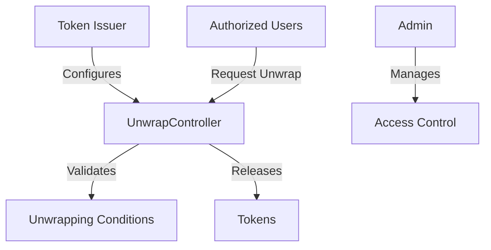

# UnwrapController: Secure Token Unwrapping Mechanism

A sophisticated smart contract for controlled and secure token unwrapping on the Stacks blockchain. UnwrapController provides a robust framework for managing token unwrapping processes with granular access control and safety mechanisms.

## Overview

UnwrapController provides a secure and flexible approach to token unwrapping, offering:

- **Controlled Token Unwrapping**: Secure, auditable token release mechanisms
- **Fine-Grained Access Control**: Granular permissions for unwrapping
- **Flexible Configuration**: Customizable unwrapping parameters
- **Immutable Tracking**: Transparent and verifiable token management
- **Safety Mechanisms**: Robust security checks and validation

## Architecture

The project is built around a central smart contract that manages token unwrapping processes. 



### Core Components:
- Token Unwrapping Management
- Authorization Registry
- Condition Validation System
- Access Control Infrastructure
- Transparent Tracking Mechanisms

## Contract Documentation

### Core Functions

#### Configuration
- `configure-unwrapping`: Set unwrapping parameters
- `add-authorized-entity`: Grant unwrapping permissions
- `remove-authorized-entity`: Revoke unwrapping permissions

#### Unwrapping Operations
- `request-unwrap`: Initiate token unwrapping
- `validate-unwrap`: Check unwrapping conditions
- `execute-unwrap`: Release tokens

### Access Control
- Contract Owner: Manages global settings and permissions
- Authorized Entities: Can request and execute token unwrapping
- Admin: Configures system parameters

## Getting Started

### Prerequisites
- Clarinet
- Stacks Wallet
- Understanding of token unwrapping processes

### Usage Examples

1. Configuring Unwrapping
```clarity
(contract-call? .unwrap-controller configure-unwrapping
    u1000000     ;; total unwrappable amount
    u10000       ;; minimum unwrap amount
    true         ;; enable partial unwrapping
)
```

2. Adding Authorized Entity
```clarity
(contract-call? .unwrap-controller add-authorized-entity
    'ST1PQHQKV0RJXZFY1DGX8MNSNYVE3VGZJSRTPGZGM  ;; entity principal
)
```

3. Requesting Unwrap
```clarity
(contract-call? .unwrap-controller request-unwrap u50000)
```

## Function Reference

### Unwrapping Management
```clarity
(configure-unwrapping 
    (total-amount uint) 
    (min-amount uint) 
    (partial-unwrap bool)
)
```

### Access Control Operations
```clarity
(add-authorized-entity (entity principal))
(remove-authorized-entity (entity principal))
```

### Token Unwrapping
```clarity
(request-unwrap (amount uint))
(validate-unwrap (amount uint))
(execute-unwrap (amount uint))
```

## Development

### Testing
1. Clone the repository
2. Install Clarinet
3. Run tests:
```bash
clarinet test
```

### Local Development
1. Start Clarinet console:
```bash
clarinet console
```
2. Deploy contract:
```clarity
(contract-call? .unwrap-controller ...)
```

## Security Considerations

### Key Safety Measures
- Strict access control for unwrapping
- Comprehensive validation of unwrapping conditions
- Configurable unwrapping parameters
- Immutable tracking of token releases

### Limitations
- Unwrapping subject to predefined conditions
- Requires authorized entity status
- Limited to configured token amounts

### Best Practices
- Carefully configure unwrapping parameters
- Maintain strict access control
- Regularly audit authorized entities
- Monitor token unwrapping activities